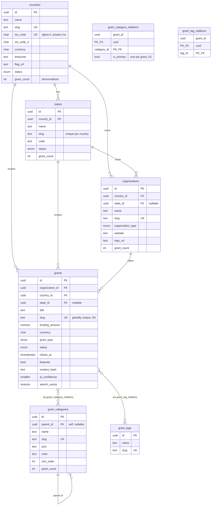
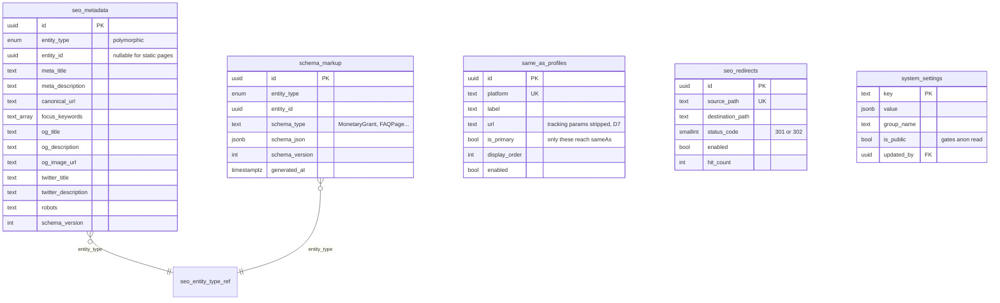

# DATABASE_ARCHITECTURE.md

Version: 1.0 — proposed, awaiting approval
Project: Grant Ninja
Database: Supabase PostgreSQL 15+
Status: **REVIEW — no migrations written yet**

Derived from `MASTER_PROJECT_SPEC.md` Parts 3A and 3B, and the decisions log in
`TASKS.md` (D1–D8).

---

## Contents

1. Principles
2. Extensions
3. Enumerated types
4. Entity relationship diagrams
5. Table reference
6. Denormalized counters and triggers
7. Full-text search
8. Row Level Security strategy
9. Indexing summary
10. Deliberate deviations from the spec
11. Open questions for review

---

# 1. Principles

Every table follows these rules unless explicitly noted.

| Rule | Implementation |
| ---- | -------------- |
| Primary key | `id uuid PRIMARY KEY DEFAULT gen_random_uuid()` |
| Timestamps | `created_at timestamptz NOT NULL DEFAULT now()`, `updated_at timestamptz NOT NULL DEFAULT now()` |
| Soft delete | `deleted_at timestamptz` on business tables; never hard-deleted (Part 5B §35) |
| Slugs | `text NOT NULL` with `CHECK (slug = lower(slug) AND slug ~ '^[a-z0-9]+(-[a-z0-9]+)*$')` |
| Money | `numeric(14,2)` — never float |
| Currency | `char(3)` ISO 4217 |
| Time | `timestamptz` everywhere, never naive `timestamp` |
| Structured blobs | `jsonb`, never `json` |
| Cascades | Ownership cascades; references restrict. See §5. |

`updated_at` is maintained by one shared trigger function rather than by
application code, so a direct SQL fix from the dashboard cannot leave a stale
timestamp behind.

---

# 2. Extensions

```sql
create extension if not exists pgcrypto;   -- gen_random_uuid()
create extension if not exists pg_trgm;    -- fuzzy title matching for dedup
create extension if not exists unaccent;   -- accent-insensitive search
-- create extension if not exists vector;  -- deferred: semantic search (§105)
```

`vector` is intentionally not enabled for the MVP. It is listed so the decision
is on record, not forgotten.

---

# 3. Enumerated types

Native Postgres enums are used where the value set is stable and small. Adding
a value later is a one-line `ALTER TYPE ... ADD VALUE`.

| Type | Values |
| ---- | ------ |
| `entity_status` | `active`, `inactive` |
| `grant_status` | `draft`, `pending_review`, `published`, `archived`, `expired` |
| `grant_funding_type` | `competitive`, `formula`, `continuation`, `cooperative_agreement`, `tax_credit`, `loan`, `voucher`, `prize`, `fellowship`, `other` |
| `organization_type` | `government_federal`, `government_state`, `government_local`, `university`, `research_council`, `innovation_agency`, `foundation`, `private` |
| `admin_role` | `super_admin`, `admin`, `editor`, `viewer` |
| `job_status` | `pending`, `running`, `completed`, `failed`, `cancelled` |
| `grant_source_type` | `official_website`, `rss`, `pdf`, `api`, `manual`, `crawler` |
| `duplicate_decision` | `duplicate`, `possible_duplicate`, `different` |
| `seo_entity_type` | `grant`, `country`, `state`, `category`, `organization`, `static_page` |
| `faq_entity_type` | `grant`, `country`, `state`, `category`, `organization`, `service`, `about`, `contact`, `home` |
| `actor_type` | `crawler`, `admin`, `ai`, `system` |
| `ai_job_status` | `success`, `failed`, `invalid_json`, `timeout` |
| `message_status` | `new`, `read`, `replied`, `archived` |
| `content_source` | `ai`, `manual` |

Note `grant_status` drops `updated` from the spec's lifecycle list. "Updated" is
an event, not a state — it is recorded in `grant_history`, and a grant that is
updated remains `published`.

---

# 4. Entity relationship diagrams

Split into four views. One diagram of 30 tables is unreadable.

## 4.1 Core geography and grants



## 4.2 Grant satellites — AI, content, provenance, history

```mermaid
erDiagram
    grants ||--o| grant_ai_content : "has one"
    grants ||--o{ grant_answer_capsules : "has"
    grants ||--o{ grant_documents : "has"
    grants ||--o{ grant_sources : "sourced from"
    grants ||--o{ grant_versions : "snapshots"
    grants ||--o{ grant_history : "audit trail"
    grants ||--o{ ai_generation_logs : "AI calls"
    grants ||--o{ faq_items : "polymorphic, D2"

    grant_ai_content {
        uuid id PK
        uuid grant_id FK_UK "1:1"
        text summary "150-300 words"
        jsonb structured_json
        text_array keywords
        text model_used
        text prompt_version
        int tokens_input
        int tokens_output
        smallint confidence
        timestamptz last_generated_at
    }
    grant_answer_capsules {
        uuid id PK
        uuid grant_id FK
        text question
        text answer "40-120 words"
        int position
        enum source
    }
    faq_items {
        uuid id PK
        enum entity_type "D2"
        uuid entity_id "nullable for static pages"
        text question
        text answer
        int sort_order
        enum source
    }
    grant_documents {
        uuid id PK
        uuid grant_id FK
        text title
        text file_url
        text document_type
        bigint file_size
        text mime_type
    }
    grant_sources {
        uuid id PK
        uuid grant_id FK
        text source_name
        text source_url
        enum source_type
        smallint confidence_score
        timestamptz last_checked
    }
    grant_versions {
        uuid id PK
        uuid grant_id FK
        int version_number "unique per grant"
        jsonb snapshot
        text content_hash
        text change_reason
    }
    grant_history {
        uuid id PK
        uuid grant_id FK
        text action
        text description
        uuid performed_by "nullable"
        enum performed_by_type
    }
    ai_generation_logs {
        uuid id PK
        uuid grant_id FK "nullable"
        text model
        text prompt_name
        text prompt_version
        int tokens_input
        int tokens_output
        int execution_ms
        enum status
        text error_message
    }
```

## 4.3 SEO and knowledge graph



`seo_entity_type_ref` is notation only — it represents the enum, not a table.

## 4.4 Crawler and operations

```mermaid
erDiagram
    countries ||--o{ crawler_sources : "scopes"
    organizations ||--o{ crawler_sources : "belongs to"
    crawler_sources ||--o{ crawler_queue : "queues"
    crawler_sources ||--o{ crawler_runs : "executes"
    crawler_sources ||--o{ crawler_pages : "tracks"
    grants ||--o{ duplicate_detection : "grant_a"
    grants ||--o{ duplicate_detection : "grant_b"
    admin_users ||--o{ audit_logs : "performs"
    admin_users ||--o{ media_library : "uploads"

    crawler_sources {
        uuid id PK
        uuid country_id FK
        uuid organization_id FK "nullable"
        text name
        text base_url
        text adapter_key "maps to Python adapter"
        text crawl_frequency "cron expression"
        smallint priority
        enum status
        int request_delay_ms
        int max_concurrency
        bool respect_robots_txt
        timestamptz last_run_at
    }
    crawler_queue {
        uuid id PK
        uuid source_id FK
        text url
        smallint priority
        enum status
        timestamptz scheduled_for
        int retry_count
        text last_error
    }
    crawler_pages {
        uuid id PK
        uuid source_id FK
        text url "unique per source"
        text content_hash "skip AI if unchanged"
        smallint http_status
        timestamptz last_crawled_at
        timestamptz last_modified_at
        text etag
    }
    crawler_runs {
        uuid id PK
        uuid source_id FK
        timestamptz started_at
        timestamptz completed_at
        int duration_ms
        int pages_scanned
        int grants_new
        int grants_updated
        int duplicates_found
        int errors
        enum status
        jsonb logs
    }
    duplicate_detection {
        uuid id PK
        uuid grant_a_id FK
        uuid grant_b_id FK
        smallint confidence
        enum decision
        text method
        bool resolved
        uuid resolved_by FK
    }
    admin_users {
        uuid id PK_FK "= auth.users.id"
        text display_name
        text email
        enum role
        text avatar_url
        enum status
        timestamptz last_login_at
    }
    audit_logs {
        uuid id PK
        uuid user_id FK "nullable"
        text action
        text entity_type
        uuid entity_id
        jsonb old_data
        jsonb new_data
        inet ip_address
    }
    contact_messages {
        uuid id PK
        text name
        text email
        text phone
        text company
        text subject
        text message
        enum status
        inet ip_address
    }
    media_library {
        uuid id PK
        text file_name
        text storage_path UK
        text mime_type
        bigint file_size
        int width
        int height
        text alt_text
        uuid uploaded_by FK
    }
```

---

# 5. Table reference

Notation: **PK** primary key, **FK** foreign key, **UK** unique, `NN` not null.

## 5.1 `countries`

| Column | Type | Constraints |
| ------ | ---- | ----------- |
| id | uuid | PK, default `gen_random_uuid()` |
| name | text | NN |
| slug | text | NN, UK, lowercase check |
| iso_code | char(2) | NN, UK — drives `/us` shortcuts (D6) |
| iso_code_3 | char(3) | UK nullable |
| currency | char(3) | NN |
| timezone | text | |
| flag_url | text | |
| description | text | long-form SEO copy for the country hub |
| status | entity_status | NN default `active` |
| grant_count | integer | NN default 0 — denormalized, trigger-maintained |
| organization_count | integer | NN default 0 |
| created_at / updated_at | timestamptz | NN |
| deleted_at | timestamptz | |

Indexes: `uk_countries_slug`, `uk_countries_iso_code`, `ix_countries_status` (partial `WHERE deleted_at IS NULL`).

## 5.2 `states`

| Column | Type | Constraints |
| ------ | ---- | ----------- |
| id | uuid | PK |
| country_id | uuid | FK → `countries(id)` **ON DELETE CASCADE**, NN |
| name | text | NN |
| slug | text | NN, lowercase check |
| code | text | e.g. `CA`, `QLD` |
| status | entity_status | NN default `active` |
| grant_count | integer | NN default 0 |
| created_at / updated_at / deleted_at | timestamptz | |

Constraints: `UNIQUE (country_id, slug)` — slugs are unique per country, not globally, so both `/countries/united-states/states/victoria` and an Australian Victoria can coexist.

Indexes: `ix_states_country_id`, `uk_states_country_slug`.

## 5.3 `organizations`

| Column | Type | Constraints |
| ------ | ---- | ----------- |
| id | uuid | PK |
| country_id | uuid | FK → `countries(id)` **ON DELETE RESTRICT**, NN |
| state_id | uuid | FK → `states(id)` **ON DELETE SET NULL**, nullable |
| name | text | NN |
| slug | text | NN, UK — public URL is `/agencies/[slug]` |
| organization_type | organization_type | NN |
| website / logo_url / description | text | |
| email / phone / address | text | |
| status | entity_status | NN default `active` |
| grant_count | integer | NN default 0 |
| created_at / updated_at / deleted_at | timestamptz | |

Indexes: `uk_organizations_slug`, `ix_organizations_country_id`, `ix_organizations_state_id`, `ix_organizations_type`.

## 5.4 `grant_categories`

| Column | Type | Constraints |
| ------ | ---- | ----------- |
| id | uuid | PK |
| parent_id | uuid | FK → `grant_categories(id)` **ON DELETE SET NULL**, nullable |
| name | text | NN |
| slug | text | NN, UK |
| description | text | |
| icon | text | Lucide icon name |
| color | text | token name, not a raw hex |
| sort_order | integer | NN default 0 |
| status | entity_status | NN default `active` |
| grant_count | integer | NN default 0 |

Hierarchy is one level deep in practice; `parent_id` exists so sub-categories
need no migration. A `CHECK (parent_id <> id)` prevents self-parenting.

## 5.5 `grants` — the main table

| Column | Type | Constraints |
| ------ | ---- | ----------- |
| id | uuid | PK |
| organization_id | uuid | FK → `organizations(id)` **ON DELETE RESTRICT**, NN |
| country_id | uuid | FK → `countries(id)` **ON DELETE RESTRICT**, NN |
| state_id | uuid | FK → `states(id)` **ON DELETE SET NULL**, nullable |
| title | text | NN |
| slug | text | NN, UK — globally unique (D5) |
| short_description | text | card summary |
| full_description | text | |
| eligibility | text | |
| funding_amount | numeric(14,2) | |
| minimum_amount | numeric(14,2) | |
| maximum_amount | numeric(14,2) | |
| currency | char(3) | NN |
| grant_type | grant_funding_type | NN default `other` |
| status | grant_status | NN default `draft` |
| application_url / official_url / source_url | text | |
| opens_at / closes_at | timestamptz | |
| published_at | timestamptz | |
| last_verified_at | timestamptz | |
| featured | boolean | NN default false |
| is_federal / is_private | boolean | NN default false |
| content_hash | text | sha256 of normalized source, drives change detection |
| ai_confidence | smallint | `CHECK (ai_confidence BETWEEN 0 AND 100)` |
| current_version | integer | NN default 1 |
| search_vector | tsvector | `GENERATED ALWAYS AS (...) STORED` — see §7 |
| created_at / updated_at / deleted_at | timestamptz | |

Business rule constraints (Part 5B §51):

```sql
CHECK (minimum_amount IS NULL OR maximum_amount IS NULL
       OR minimum_amount <= maximum_amount)
CHECK (opens_at IS NULL OR closes_at IS NULL OR opens_at <= closes_at)
CHECK (funding_amount IS NULL OR funding_amount >= 0)
CHECK (status <> 'published' OR published_at IS NOT NULL)
CHECK (status <> 'published' OR official_url IS NOT NULL)
```

`is_active` from the spec is removed: it duplicates `status` and would drift.
"Active" is derived — `status = 'published' AND (closes_at IS NULL OR closes_at > now())`.

Indexes:

| Index | Definition | Serves |
| ----- | ---------- | ------ |
| `uk_grants_slug` | UNIQUE (slug) | detail page lookup |
| `ix_grants_status_published` | (status, published_at DESC) WHERE deleted_at IS NULL | listings, "latest" |
| `ix_grants_country` | (country_id, status) WHERE deleted_at IS NULL | country pages |
| `ix_grants_state` | (state_id) WHERE state_id IS NOT NULL | state pages |
| `ix_grants_organization` | (organization_id, status) | agency pages |
| `ix_grants_closes_at` | (closes_at) WHERE status = 'published' | "closing soon", expiry job |
| `ix_grants_funding` | (funding_amount) WHERE deleted_at IS NULL | amount filter |
| `ix_grants_featured` | (featured, published_at DESC) WHERE featured | homepage |
| `ix_grants_updated` | (updated_at DESC) WHERE status = 'published' | "recently updated" |
| `ix_grants_content_hash` | (content_hash) | crawler change detection |
| `ix_grants_confidence` | (ai_confidence) WHERE status = 'pending_review' | review queue |
| `ix_grants_search` | GIN (search_vector) | full-text search |
| `ix_grants_title_trgm` | GIN (title gin_trgm_ops) | fuzzy dedup |

## 5.6 `grant_category_relations` — D1

| Column | Type | Constraints |
| ------ | ---- | ----------- |
| grant_id | uuid | FK → `grants(id)` **ON DELETE CASCADE**, NN |
| category_id | uuid | FK → `grant_categories(id)` **ON DELETE CASCADE**, NN |
| is_primary | boolean | NN default false |
| created_at | timestamptz | NN |

`PRIMARY KEY (grant_id, category_id)`.

Exactly one primary category per grant, enforced by the database rather than
application code:

```sql
CREATE UNIQUE INDEX uk_grant_primary_category
  ON grant_category_relations (grant_id) WHERE is_primary;
```

The primary category is what breadcrumbs and `/countries/x/categories/y`
scoping use. A grant with zero primary categories is caught by a validation
check at publish time, not by the index (a partial unique index cannot enforce
"at least one").

Index: `ix_gcr_category_id` on (category_id) for category listing pages.

## 5.7 `grant_tags` / `grant_tag_relations`

`grant_tags`: id, name NN, slug NN UK, color, created_at.
`grant_tag_relations`: (grant_id, tag_id) PK, both FKs **ON DELETE CASCADE**.
Index `ix_gtr_tag_id` for tag listing.

## 5.8 `grant_ai_content`

One row per grant. Separated from `grants` so AI output can be regenerated
without touching source-of-truth data (Part 3A rationale).

| Column | Type | Constraints |
| ------ | ---- | ----------- |
| id | uuid | PK |
| grant_id | uuid | FK → `grants(id)` **ON DELETE CASCADE**, NN, **UNIQUE** |
| summary | text | 150–300 words |
| keywords | text[] | |
| structured_json | jsonb | raw validated Gemini payload |
| model_used | text | NN |
| prompt_version | text | NN — enables targeted regeneration |
| tokens_input / tokens_output | integer | |
| confidence | smallint | CHECK 0–100 |
| last_generated_at | timestamptz | NN |

## 5.9 `faq_items` — D2

Polymorphic, attachable to any entity or static page.

| Column | Type | Constraints |
| ------ | ---- | ----------- |
| id | uuid | PK |
| entity_type | faq_entity_type | NN |
| entity_id | uuid | nullable — NULL for static pages (`about`, `contact`, `home`, `service`) |
| question | text | NN |
| answer | text | NN |
| sort_order | integer | NN default 0 |
| source | content_source | NN default `manual` |

```sql
CHECK (
  (entity_type IN ('grant','country','state','category','organization')
     AND entity_id IS NOT NULL)
  OR
  (entity_type IN ('service','about','contact','home') AND entity_id IS NULL)
)
```

Index: `ix_faq_entity` on (entity_type, entity_id, sort_order).

Polymorphic tables cannot carry a real foreign key. Two mitigations:
a `BEFORE INSERT/UPDATE` trigger that verifies the referenced row exists, and
an `AFTER DELETE` trigger on each parent that removes orphaned FAQs. This is
the same trade-off `schema_markup` already makes in the spec.

## 5.10 `grant_answer_capsules`

id, grant_id FK **CASCADE** NN, question NN, answer NN (40–120 words),
position integer NN, source `content_source`.
`UNIQUE (grant_id, position)`. Index `ix_capsules_grant_id`.

Kept separate from `faq_items` because capsules are a different content type:
they answer a fixed question set, are length-constrained for AI citation, and
render above the fold.

## 5.11 `grant_versions`

| Column | Type | Constraints |
| ------ | ---- | ----------- |
| id | uuid | PK |
| grant_id | uuid | FK **CASCADE**, NN |
| version_number | integer | NN |
| snapshot | jsonb | NN — the full grant row at that moment |
| content_hash | text | NN |
| change_reason | text | |
| created_by | uuid | FK → `admin_users(id)`, nullable |
| created_by_type | actor_type | NN |
| created_at | timestamptz | NN |

`UNIQUE (grant_id, version_number)`. Index `ix_versions_grant_created` on
(grant_id, created_at DESC).

Versions are **append-only**. No UPDATE or DELETE policy exists for any role
except the secret key. A `jsonb` snapshot is used rather than mirrored columns
so a future column addition does not require backfilling history.

## 5.12 `grant_sources`, `grant_documents`, `grant_history`

`grant_sources`: id, grant_id FK CASCADE, source_name, source_url NN,
source_type enum, confidence_score smallint, last_checked timestamptz.
`UNIQUE (grant_id, source_url)`.

`grant_documents`: id, grant_id FK CASCADE, title NN, file_url NN,
document_type, file_size bigint, mime_type, sort_order.

`grant_history`: id, grant_id FK CASCADE, action text NN, description,
performed_by uuid nullable, performed_by_type `actor_type` NN, created_at.
Index (grant_id, created_at DESC). Append-only.

## 5.13 `seo_metadata`

Polymorphic, one row per public page.

id, entity_type `seo_entity_type` NN, entity_id uuid nullable,
static_page_key text nullable, meta_title, meta_description, canonical_url,
focus_keywords text[], og_title, og_description, og_image_url, twitter_title,
twitter_description, robots text default `index,follow`, schema_version int.

`UNIQUE (entity_type, entity_id, static_page_key)` — one SEO record per page.

## 5.14 `schema_markup`

id, entity_type NN, entity_id nullable, schema_type text NN
(`MonetaryGrant`, `Organization`, `FAQPage`, `BreadcrumbList`, `WebSite`,
`CollectionPage`), schema_json jsonb NN, schema_version int NN,
generated_at timestamptz NN.
`UNIQUE (entity_type, entity_id, schema_type)`.

## 5.15 `same_as_profiles` — D7

id, platform text NN UK, label text NN, url text NN, is_primary boolean NN,
display_order int NN, enabled boolean NN default true.

```sql
CHECK (url ~ '^https://')
CHECK (url NOT ILIKE '%utm|_%' AND position('?' in url) = 0
       OR url !~* '[?&](utm_|_ga|_gl|gclid|fbclid|msclkid)')
```

Seeded from `frontend/config/social-profiles.ts`. Only `is_primary AND enabled`
rows are emitted in Organization JSON-LD.

## 5.16 `seo_redirects`

id, source_path text NN UK, destination_path text NN, status_code smallint NN
`CHECK (status_code IN (301,302))`, enabled boolean, hit_count integer,
created_at. Index on `source_path` (the unique index serves lookups).

## 5.17 `system_settings` — D8

Key/value rather than one wide row, so adding a setting needs no migration.

| Column | Type | Constraints |
| ------ | ---- | ----------- |
| key | text | PK |
| value | jsonb | NN |
| group_name | text | NN — `branding`, `contact`, `seo`, `analytics`, `ai`, `crawler` |
| description | text | shown as help text in the admin form |
| is_public | boolean | NN default false — gates anonymous read |
| updated_by | uuid | FK → `admin_users(id)` |
| updated_at | timestamptz | NN |

`is_public` is the security boundary: `site_name` and `logo_url` are public;
`gemini_model` and `auto_publish_confidence_threshold` are not. The shape of
the settings map mirrors `frontend/types/site-settings.ts`.

## 5.18 Crawler tables

`crawler_sources`: id, country_id FK RESTRICT NN, organization_id FK SET NULL,
name NN, base_url NN, adapter_key text NN (maps to the Python adapter module),
crawl_frequency text (cron), priority smallint, status `entity_status`,
request_delay_ms int, max_concurrency int, respect_robots_txt boolean default
true, last_run_at, timestamps.

`crawler_queue`: id, source_id FK CASCADE NN, url text NN, priority smallint,
status `job_status`, scheduled_for timestamptz, started_at, completed_at,
retry_count int, last_error text.
Index: `(status, priority DESC, scheduled_for)` — the worker's dequeue path.

`crawler_pages`: id, source_id FK CASCADE NN, url text NN, content_hash text,
http_status smallint, etag text, last_crawled_at, last_modified_at.
`UNIQUE (source_id, url)`. Index on `content_hash`.
This table is the cost lever: an unchanged hash skips fetch, AI and SEO.

`crawler_runs`: id, source_id FK CASCADE NN, started_at NN, completed_at,
duration_ms, pages_scanned, grants_new, grants_updated, duplicates_found,
errors, status `job_status`, logs jsonb.
Index `(source_id, started_at DESC)`.

`duplicate_detection`: id, grant_a_id FK CASCADE NN, grant_b_id FK CASCADE NN,
confidence smallint, decision `duplicate_decision`, method text
(`hash` / `rapidfuzz` / `gemini`), resolved boolean, resolved_by FK, created_at.

```sql
CHECK (grant_a_id <> grant_b_id)
-- store the pair once, in a stable order
CHECK (grant_a_id < grant_b_id)
UNIQUE (grant_a_id, grant_b_id)
```

## 5.19 `admin_users`

Extends Supabase Auth rather than replacing it.

| Column | Type | Constraints |
| ------ | ---- | ----------- |
| id | uuid | PK, FK → `auth.users(id)` **ON DELETE CASCADE** |
| display_name | text | NN |
| email | text | NN |
| role | admin_role | NN default `viewer` |
| avatar_url | text | |
| status | entity_status | NN default `active` |
| last_login_at | timestamptz | |

A row is created by an `AFTER INSERT` trigger on `auth.users`. New users default
to `viewer` — privilege is granted deliberately, never by signing up.

## 5.20 `audit_logs`, `contact_messages`, `media_library`

`audit_logs`: id, user_id FK SET NULL, action text NN, entity_type text NN,
entity_id uuid, old_data jsonb, new_data jsonb, ip_address inet, created_at.
Index `(entity_type, entity_id, created_at DESC)` and `(user_id, created_at DESC)`.
Append-only.

`contact_messages`: id, name NN, email NN `CHECK (email ~* '^[^@\s]+@[^@\s]+\.[^@\s]+$')`,
phone, company, subject, message NN, status `message_status`, ip_address inet,
created_at. Index `(status, created_at DESC)`.

`media_library`: id, file_name NN, storage_path text NN UK, mime_type NN,
file_size bigint, width int, height int, alt_text text, uploaded_by FK SET NULL,
created_at.

---

# 6. Denormalized counters and triggers

Four shared trigger functions, applied broadly:

| Function | Purpose |
| -------- | ------- |
| `touch_updated_at()` | Sets `updated_at = now()`. Attached to every table with that column. |
| `sync_grant_counts()` | Maintains `grant_count` on countries, states, organizations and categories when a grant's status, country, state, organization or category set changes. |
| `enforce_polymorphic_parent()` | Verifies `entity_id` exists for the given `entity_type` on `faq_items`, `seo_metadata`, `schema_markup`. |
| `handle_new_auth_user()` | Creates the `admin_users` row on `auth.users` insert, defaulting to `viewer`. |

Counters are denormalized deliberately: the homepage and every directory card
shows counts, and a `COUNT(*)` per card does not scale past a few thousand
grants. They are recomputable — a nightly job re-derives them so a missed
trigger cannot silently drift.

---

# 7. Full-text search

A generated column, not a separate `search_index` table:

```sql
search_vector tsvector GENERATED ALWAYS AS (
  setweight(to_tsvector('english', coalesce(title,'')), 'A') ||
  setweight(to_tsvector('english', coalesce(short_description,'')), 'B') ||
  setweight(to_tsvector('english', coalesce(eligibility,'')), 'C') ||
  setweight(to_tsvector('english', coalesce(full_description,'')), 'D')
) STORED
```

Weighting puts a title match above a body match. `pg_trgm` on `title` handles
typo tolerance and feeds the duplicate detector's fuzzy stage.

This replaces the spec's `search_index` table. A generated column cannot fall
out of sync, needs no re-index job, and removes an entire failure mode from the
publish transaction. Organization, country and category names are joined at
query time rather than duplicated into the vector.

---

# 8. Row Level Security strategy

RLS is enabled on **every** table. A table with RLS enabled and no policy denies
all access to `anon` and `authenticated` — which is the correct default.

## 8.1 Roles

| Role | Key | Access model |
| ---- | --- | ------------ |
| `anon` | publishable | Read-only, published content only |
| `authenticated` | publishable + session | Admin capabilities per `admin_users.role` |
| service | secret key | Bypasses RLS entirely. Python pipeline and trusted server jobs. |

## 8.2 Helper functions

Both are `SECURITY DEFINER` and `STABLE`, which avoids infinite recursion when
a policy on `admin_users` needs to read `admin_users`:

```sql
CREATE FUNCTION public.current_admin_role() RETURNS admin_role
  LANGUAGE sql SECURITY DEFINER STABLE SET search_path = public AS $$
    SELECT role FROM admin_users
     WHERE id = auth.uid() AND status = 'active' AND deleted_at IS NULL
$$;

CREATE FUNCTION public.is_admin_at_least(required admin_role) RETURNS boolean
  LANGUAGE sql SECURITY DEFINER STABLE SET search_path = public AS $$
    SELECT CASE public.current_admin_role()
      WHEN 'super_admin' THEN true
      WHEN 'admin'  THEN required <> 'super_admin'
      WHEN 'editor' THEN required IN ('editor','viewer')
      WHEN 'viewer' THEN required = 'viewer'
      ELSE false END
$$;
```

## 8.3 Three tiers

**Tier 1 — Public read.** Anonymous visitors read published, non-deleted rows.

Tables: `countries`, `states`, `organizations`, `grant_categories`, `grants`,
`grant_category_relations`, `grant_tags`, `grant_tag_relations`,
`grant_ai_content`, `grant_answer_capsules`, `faq_items`, `grant_documents`,
`grant_sources`, `seo_metadata`, `schema_markup`, `same_as_profiles`,
`seo_redirects`.

```sql
-- grants: the shape every Tier 1 policy follows
CREATE POLICY grants_public_read ON grants FOR SELECT TO anon, authenticated
  USING (status = 'published' AND deleted_at IS NULL);

-- child rows are visible only if their parent grant is
CREATE POLICY ai_content_public_read ON grant_ai_content FOR SELECT TO anon, authenticated
  USING (EXISTS (
    SELECT 1 FROM grants g
     WHERE g.id = grant_ai_content.grant_id
       AND g.status = 'published' AND g.deleted_at IS NULL));

-- reference data: active and not deleted
CREATE POLICY countries_public_read ON countries FOR SELECT TO anon, authenticated
  USING (status = 'active' AND deleted_at IS NULL);

CREATE POLICY same_as_public_read ON same_as_profiles FOR SELECT TO anon, authenticated
  USING (enabled);
```

A draft grant is invisible to `anon` even by direct id. `faq_items` and
`seo_metadata` rows attached to an unpublished grant are hidden by the same
parent-existence test.

**Tier 2 — Admin.** No anonymous access. Writes gated by role.

Tables: `contact_messages` (read), `media_library`, `system_settings`
(non-public keys), plus all write policies on Tier 1 tables.

```sql
CREATE POLICY grants_editor_write ON grants FOR ALL TO authenticated
  USING (public.is_admin_at_least('editor'))
  WITH CHECK (public.is_admin_at_least('editor'));

CREATE POLICY settings_public_read ON system_settings FOR SELECT TO anon, authenticated
  USING (is_public);

CREATE POLICY settings_admin_all ON system_settings FOR ALL TO authenticated
  USING (public.is_admin_at_least('admin'))
  WITH CHECK (public.is_admin_at_least('admin'));
```

**Tier 3 — Service only.** RLS enabled, no policy for `anon` or
`authenticated` beyond read for admins. Only the secret key writes.

Tables: `crawler_sources`, `crawler_queue`, `crawler_pages`, `crawler_runs`,
`duplicate_detection`, `ai_generation_logs`, `grant_versions`, `grant_history`,
`audit_logs`.

```sql
CREATE POLICY crawler_runs_admin_read ON crawler_runs FOR SELECT TO authenticated
  USING (public.is_admin_at_least('viewer'));
-- no INSERT/UPDATE/DELETE policy: the pipeline uses the secret key
```

## 8.4 Special cases

`contact_messages` — anonymous INSERT, never SELECT:

```sql
CREATE POLICY contact_anon_insert ON contact_messages FOR INSERT TO anon
  WITH CHECK (true);
CREATE POLICY contact_admin_read ON contact_messages FOR SELECT TO authenticated
  USING (public.is_admin_at_least('editor'));
```

Rate limiting is an application concern; RLS cannot express it. The Server
Action throttles by IP before inserting.

`admin_users` — a user reads their own row; only `super_admin` changes roles:

```sql
CREATE POLICY admin_self_read ON admin_users FOR SELECT TO authenticated
  USING (id = auth.uid() OR public.is_admin_at_least('admin'));
CREATE POLICY admin_super_write ON admin_users FOR ALL TO authenticated
  USING (public.is_admin_at_least('super_admin'))
  WITH CHECK (public.is_admin_at_least('super_admin'));
```

Append-only tables (`grant_versions`, `grant_history`, `audit_logs`) get
**no** UPDATE or DELETE policy for any role. History cannot be rewritten
through the API.

---

# 9. Indexing summary

| Access pattern | Index |
| -------------- | ----- |
| Grant detail by slug | `uk_grants_slug` |
| Grant listing, newest first | `ix_grants_status_published` |
| Country / state / agency pages | `ix_grants_country`, `ix_grants_state`, `ix_grants_organization` |
| Category page | `ix_gcr_category_id` + `uk_grant_primary_category` |
| Closing soon, expiry job | `ix_grants_closes_at` |
| Funding filter | `ix_grants_funding` |
| Homepage featured | `ix_grants_featured` |
| Recently updated | `ix_grants_updated` |
| Keyword search | `ix_grants_search` (GIN) |
| Fuzzy dedup | `ix_grants_title_trgm` (GIN) |
| Crawler skip-if-unchanged | `uk_crawler_pages_source_url`, `ix_crawler_pages_hash` |
| Queue dequeue | `ix_crawler_queue_dispatch` |
| Review queue | `ix_grants_confidence` |
| Audit lookup | `ix_audit_entity`, `ix_audit_user` |

Every foreign key has a covering index. Postgres does not create these
automatically, and their absence makes cascading deletes and joins sequential
scans.

Listing indexes are **partial** (`WHERE deleted_at IS NULL`, or
`WHERE status = 'published'`) so archived rows do not inflate them.

---

# 10. Deliberate deviations from the spec

Each of these is a considered change, not an oversight. Reject any and I will
revert it.

| # | Spec says | Proposed | Why |
| - | --------- | -------- | --- |
| V1 | `grants.category_id` single FK | `grant_category_relations` join table | D1 — you approved multiple categories |
| V2 | `grant_faq` + `faq_items` both exist | `faq_items` only, polymorphic | D2 — one FAQ system; two tables would duplicate logic |
| V3 | `grant_seo` per-grant table | `seo_metadata` polymorphic | Countries, categories and agencies all need SEO. Six near-identical tables would drift. Matches the spec's own `schema_markup` pattern. |
| V4 | `search_index` table | generated `tsvector` column | Cannot fall out of sync, no re-index job, one less failure mode in the publish transaction |
| V5 | `grants.is_active` | derived from `status` + `closes_at` | Two sources of truth for the same fact will disagree |
| V6 | `grant_status` includes `updated` | removed | "Updated" is an event (`grant_history`), not a state |
| V7 | `grant_versions` mirrored columns | `jsonb` snapshot | Adding a grant column later would otherwise require backfilling every historical version |
| V8 | `crawler_sources.frequency` free text | cron expression + `adapter_key` | The scheduler needs a parseable value and an explicit link to its Python adapter |

---

# 11. Open questions for review

1. **Currency on grants.** Currently `char(3)` NN, defaulting from the country.
   Should a grant be able to advertise funding in a currency other than its
   country's (for example an EU programme quoting EUR for an Irish grant)?
   Current design allows it; confirm that is wanted.

2. **`states` for countries without them.** Ireland has counties, Singapore has
   none. `state_id` is nullable throughout, so this works — but should the
   country hub hide the "Browse by state" section automatically when a country
   has zero states? I assume yes.

3. **Grant slug collisions.** D5 says globally unique with suffixing. My default
   suffix is the country slug (`innovation-fund-ireland`), falling back to the
   organization slug, then a short hash. Confirm the country suffix is the
   preferred first choice.

4. **`viewer` role.** The spec lists it as future. I have included it in the
   enum and the permission ladder now, since adding an enum value later is
   trivial but reworking policies is not. No user will be assigned it yet.

5. **Retention.** `crawler_pages` and `ai_generation_logs` grow fastest. I
   propose 90-day retention on `ai_generation_logs` and keeping
   `crawler_pages` indefinitely (it is the cost-saving cache). Confirm.

---

# Approval

Once approved, the migration set will be created in this order:

```
0001_extensions_and_enums
0002_shared_functions_and_triggers
0003_geography          -- countries, states
0004_organizations
0005_categories_and_tags
0006_grants
0007_grant_relations    -- categories, tags, documents, sources
0008_grant_ai_content   -- ai content, answer capsules, faq_items
0009_grant_history      -- versions, history
0010_seo                -- seo_metadata, schema_markup, same_as_profiles, redirects
0011_crawler
0012_platform           -- admin_users, system_settings, audit_logs, contact, media
0013_rls_policies
0014_seed               -- countries, categories, same_as_profiles, settings
```

Each migration is reversible and independently reviewable.
